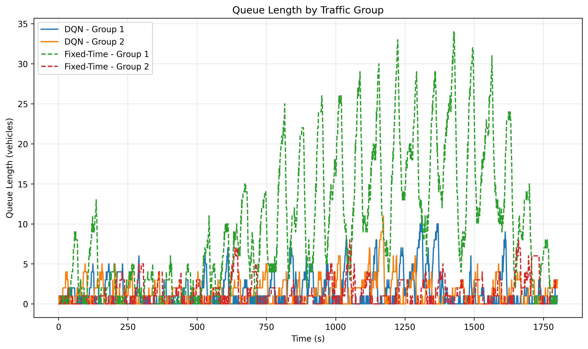
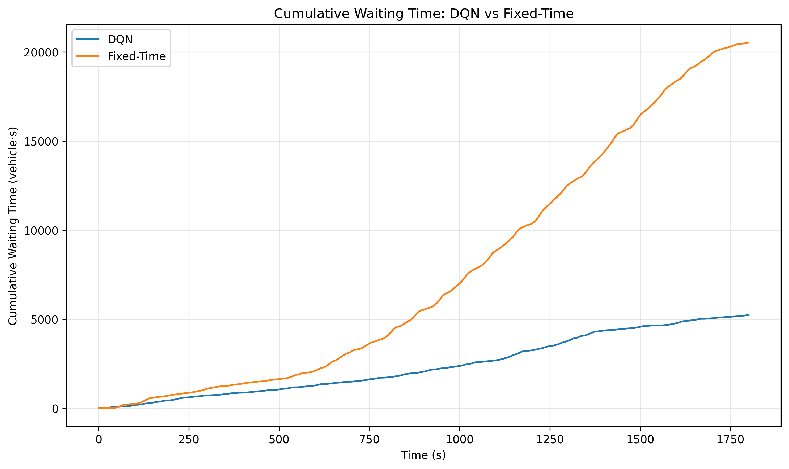
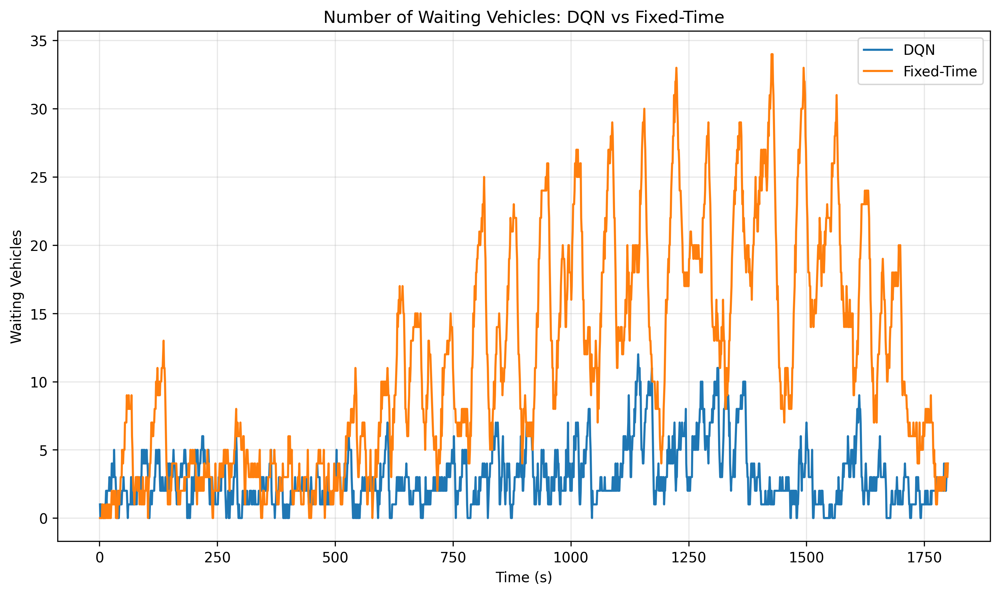

# Traffic Light Control with Deep Q-Learning

This project uses **Deep Q-Learning (DQN)** to control a traffic light at a real road intersection modeled in **SUMO**.

The objective is to learn when to keep the current green light and when to switch to the other traffic direction, while reducing traffic queues and waiting time.

---

## Project Overview

The simulation contains **one four-way intersection** controlled by a traffic light.

The traffic signal is identified in SUMO by:

```text
Traffic Light ID: 319612951
```

The four incoming lanes are divided into two traffic groups:

```text
                 Group 2
              29057921_0
                   ↓
                   │
                   │
Group 1 →   [  INTERSECTION  ]   ← Group 1
-371466059_0                    29057968_0
                   │
                   │
                   ↑
              -371466060_0
                 Group 2
```

### Traffic groups

**Group 1**

* `-371466059_0`
* `29057968_0`

**Group 2**

* `29057921_0`
* `-371466060_0`

These are **SUMO lane IDs**. Each lane belongs to one incoming road of the intersection.

---

### Traffic Signal Phase Switching

The four incoming lanes are divided into two traffic groups according to the traffic signal phases. The lanes belonging to the same group are assigned the green signal simultaneously, while the lanes of the other group remain red. Consequently, the intersection operates by alternating between these two groups rather than controlling each incoming lane independently.

**Group 1** consists of lanes `-371466059_0` and `29057968_0`, while **Group 2** consists of lanes `29057921_0` and `-371466060_0`.

During the control process, one group remains active with a green signal while the other is stopped. When the DQN selects a switching action, the current green phase is followed by a yellow transition phase before the other group receives the green signal. The phase sequence is therefore:

**Group 1 (Green) → Yellow → Group 2 (Green) → Yellow → Group 1 (Green) → ...**

The agent's decision is not which individual lane should receive green, but **whether to maintain the current traffic group or switch the green signal to the other group**.

---

## Deep Q-Learning

The DQN observes the traffic conditions and chooses between two actions:

| Action | Meaning                           |
| ------ | --------------------------------- |
| `0`    | Keep the current green phase      |
| `1`    | Switch to the other traffic group |

The controller cannot switch immediately. A minimum green time of **10 seconds** is imposed before a change is allowed.

When a change is made, a **4-second yellow phase** is applied before the next group receives green.

---

## State Representation

The DQN uses three values to describe the current traffic situation:

```text
State = [Q1 / 30, Q2 / 30, L]
```

where:

* `Q1` = number of halted vehicles on Group 1 lanes
* `Q2` = number of halted vehicles on Group 2 lanes
* `30` = maximum queue value used for normalization
* `L` = currently active traffic group (`0` or `1`)

The queue values are calculated directly from SUMO using:

```python
traci.lane.getLastStepHaltingNumber()
```

---

## Reward Function

The agent is rewarded for keeping queues small.

The reward is:

$$
r_t = -(Q_1^2 + Q_2^2)
$$

Large queues therefore produce a more negative reward.

The squared queue values also make larger traffic queues more costly for the agent.

---

## DQN Architecture

The neural network takes the 3-dimensional state as input and predicts the value of the two possible actions.

```text
Input
  │
  ├── Q1 / 30
  ├── Q2 / 30
  └── L
       │
       ▼
   Dense(64, ReLU)
       │
       ▼
   Dense(64, ReLU)
       │
       ▼
   2 Q-values
       │
       ├── Action 0: Continue
       └── Action 1: Switch
```

### Main parameters

| Parameter         | Value |
| ----------------- | ----: |
| State size        |     3 |
| Actions           |     2 |
| Hidden layers     |     2 |
| Neurons per layer |    64 |
| Discount factor γ |  0.99 |
| Learning rate     | 0.001 |
| Replay memory     |  5000 |
| Batch size        |   125 |
| Initial ε         |   1.0 |
| Minimum ε         |  0.05 |
| ε decay           |  0.98 |
| Training episodes |   300 |
| Steps per episode |   180 |

A **target network** is also used to improve training stability.

---

## Traffic Simulation

The environment is simulated with **SUMO** and controlled through **TraCI**.

The simulation runs for:

```text
180 × 10 seconds = 1800 seconds
```

The traffic demand is asymmetric, with higher traffic demand on Group 1 than Group 2.

This allows the DQN to learn how to react to different traffic conditions instead of using a fixed timing for both directions.

---

## DQN vs Fixed-Time Control

The trained DQN controller is compared with a conventional **fixed-time traffic light controller**.

The comparison focuses on:

* Average queue length
* Maximum queue length
* Average waiting time
* Total waiting time
* Number of stops
* Vehicles arrived
* Traffic throughput

The same SUMO network and traffic environment are used for both controllers.

---

## Results

The main results are presented using four figures:

### Queue Length

Comparison of the total number of queued vehicles over the simulation.

### Waiting Vehicles

Number of vehicles currently waiting during the simulation.

### Cumulative Waiting Time

Evolution of the cumulative waiting time in vehicle-seconds.

### Queue by Traffic Group

Queue evolution separately for Group 1 and Group 2.

Figures are available in:

```text
figures/
```

---

## Repository Structure

```text
traffic-light-dqn/
│
├── README.md
├── requirements.txt
├── .gitignore
│
├── src/
│   ├── train_dqn.py
│   ├── test_dqn.py
│   ├── test_fixed.py
│   └── plot_results.py
│
├── config/
│   ├── traffic_dql.sumocfg
│   ├── traffic_dql.net.xml
│   └── traffic_dql.rou.xml
│
├── figures/
│   ├── waiting_vehicles_comparison.png
│   ├── cumulative_waiting_time_comparison.png
│   └── queue_by_traffic_group.png
│
├── data/
│   ├── test_dqn_timeseries_v2.csv
│   └── test_fixed_timeseries_v2.csv
│
└── models/
    └── dqn_single_intersection_v2.keras
```

### Directory and File Description

**`src/`** contains the Python scripts used to train, evaluate, and analyze the traffic-light controllers.

* `train_dqn.py` — trains the DQN agent using the SUMO traffic environment.
* `test_dqn.py` — evaluates the trained DQN controller.
* `test_fixed.py` — runs the fixed-time controller used as the baseline.
* `plot_results.py` — generates plots from the experimental results.

**`config/`** contains the SUMO simulation configuration files.

* `traffic_dql.sumocfg` — main SUMO configuration file.
* `traffic_dql.net.xml` — defines the road network and traffic-light intersection.
* `traffic_dql.rou.xml` — contains traffic-related route and flow definitions used by the simulation.

**`figures/`** contains the figures generated from the experiments.

* `waiting_vehicles_comparison.png` — compares the number of waiting vehicles.
* `cumulative_waiting_time_comparison.png` — compares cumulative waiting time.
* `queue_by_traffic_group.png` — shows queue evolution for the two traffic groups.

**`data/`** contains the time-series data collected during the experiments.

* `test_dqn_timeseries_v2.csv` — time-series results from the DQN controller.
* `test_fixed_timeseries_v2.csv` — time-series results from the fixed-time controller.

**`models/`** contains the trained machine-learning model.

* `dqn_single_intersection_v2.keras` — trained DQN model used for traffic-light control.

---

## Technologies

* **Python**
* **TensorFlow / Keras**
* **Deep Q-Learning**
* **SUMO**
* **TraCI**
* **NumPy**
* **Pandas**
* **Matplotlib**

---

## Main Idea

The project follows this workflow:

```text
SUMO Traffic Simulation
          │
          ▼
     Traffic State
   [Q1, Q2, L]
          │
          ▼
      DQN Agent
          │
          ▼
   Choose an Action
     ┌────┴────┐
     │         │
 Continue    Switch
     │         │
     └────┬────┘
          ▼
   Traffic evolves
          │
          ▼
       Reward
          │
          └──────► DQN learns
```

The final goal is to study whether a **reinforcement-learning-based traffic signal controller** can adapt to changing traffic conditions compared with a conventional fixed-time controller.

## Results

The DQN controller was evaluated against a fixed-time traffic light strategy under the same traffic scenario over a 1800-second simulation.

### Queue Length by Traffic Group



This figure compares the evolution of queue lengths for the two traffic groups under the DQN and Fixed-Time controllers.

The Fixed-Time strategy shows a strong accumulation of vehicles in Group 1 during the high-demand period, with a maximum queue of approximately 34 vehicles. In comparison, the DQN controller keeps the queues considerably shorter, with a maximum of about 11 vehicles.

The DQN controller adapts its phase-switching decisions according to the observed traffic conditions, which helps prevent the progressive accumulation of vehicles and maintains a better balance between the two traffic groups.

At the highest congestion point, the maximum queue is reduced by approximately 68% with DQN compared with Fixed-Time.

> **Note:** These results come from a single simulation scenario. Further experiments with different traffic demands and random seeds would be required to assess the robustness of the approach.

### Cumulative Waiting Time



This figure shows the cumulative waiting time experienced by vehicles throughout the 1800-second simulation.

During the high-demand period, the Fixed-Time controller accumulates waiting time much faster than the DQN controller. At the end of the simulation, the cumulative waiting time is approximately **20,500 vehicle·s** for Fixed-Time compared with approximately **5,200 vehicle·s** for DQN.

This corresponds to a reduction of approximately **75%** in cumulative waiting time. The result is consistent with the shorter queues observed with the DQN controller and indicates that the adaptive policy reduces the time vehicles spend waiting at the intersection.

> **Note:** These results correspond to a single simulation scenario.

### Waiting Vehicles



This figure compares the number of waiting vehicles over time for the DQN and Fixed-Time controllers.

The Fixed-Time strategy produces considerably higher numbers of waiting vehicles during periods of increased traffic demand, while the DQN controller generally maintains a lower number of waiting vehicles.

This indicates that the DQN agent is able to react to changes in traffic conditions by choosing when to switch the traffic-light phase, helping to reduce congestion at the intersection.

### Overall Interpretation

Overall, the results show that the DQN controller performs better than the Fixed-Time strategy under the tested traffic conditions. It reduces queue lengths, the number of waiting vehicles, and cumulative waiting time, particularly during periods of high traffic demand.

## Limitations

- The DQN agent controls phase switching but does not directly optimize the duration of each traffic-light phase. Decisions are made at fixed 10-second intervals, which limits the flexibility of the controller.
- The controller is evaluated on a single intersection and does not consider interactions between multiple traffic lights.
- The state representation is relatively simple, mainly based on queue lengths and the current traffic-light phase.
- The controller manages two traffic groups rather than optimizing individual lanes or traffic movements separately.
- The experiments are performed in a simulated SUMO environment and may not capture all real-world traffic conditions.
- The evaluation is conducted under a limited number of traffic scenarios, so further testing is needed to assess the robustness of the approach under different traffic demands.

## Conclusion

This project demonstrates the application of Deep Q-Learning to adaptive traffic-light control using the SUMO traffic simulation environment.

Compared with the Fixed-Time strategy, the DQN controller achieved lower queue lengths, fewer waiting vehicles, and substantially lower cumulative waiting time in the tested scenario. These results demonstrate the potential of reinforcement learning to improve traffic signal control by adapting phase-switching decisions to changing traffic conditions.

## Future Perspectives

Several improvements could be explored in future work:

- Directly optimizing the duration of traffic-light phases instead of only controlling phase switching.
- Extending the approach to multiple connected intersections.
- Using richer traffic states, including vehicle speeds, traffic density, and approaching vehicles.
- Optimizing individual traffic movements or lanes instead of using two aggregated traffic groups.
- Testing Double DQN (DDQN) and other reinforcement learning algorithms.
- Evaluating the controller under a wider range of traffic demand scenarios.
- Moving toward more realistic traffic scenarios and real-world traffic data.
